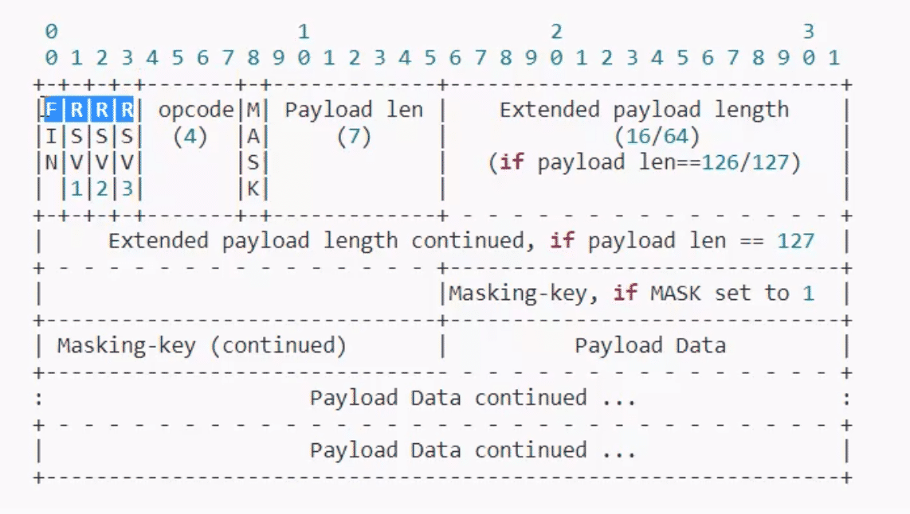

# handwrite-websocket

## Content

* websocket原理
* nodejs手写实现websocket协议
  * http复用
  * 数据帧解析
  * 完成监听和发送



## Notes

### 258EAFA5-E914-47DA-95CA-C5AB0DC85B11

* GUID `258EAFA5-E914-47DA-95CA-C5AB0DC85B11`
  * 凭什么是这个code？
    * 这是一个 `Pre Shared Key`，大家提前双方约定的
  * 具体使用：**`Sec-WebSocket-Accept = base64(sha1(sec-websocket-key + 258EAFA5-E914-47DA-95CA-C5AB0DC85B11))`**
  * 具体实现:

```js
function toAcceptKey(wsKey) {
  return crypto
    .createHash('sha1')
    .update(wsKey + CODE)
    .digest('base64');
}
```

### 反掩码

* 遍历buffer中bit分别于mask 异或
* mask固定只有4bit，所以求余循环

```js
function unmask(buffer, mask) {
  const length = buffer.length;
  for (let i = 0; i < length; i++) {
    buffer[i] ^= mask[i % 4];
  }
}
```
